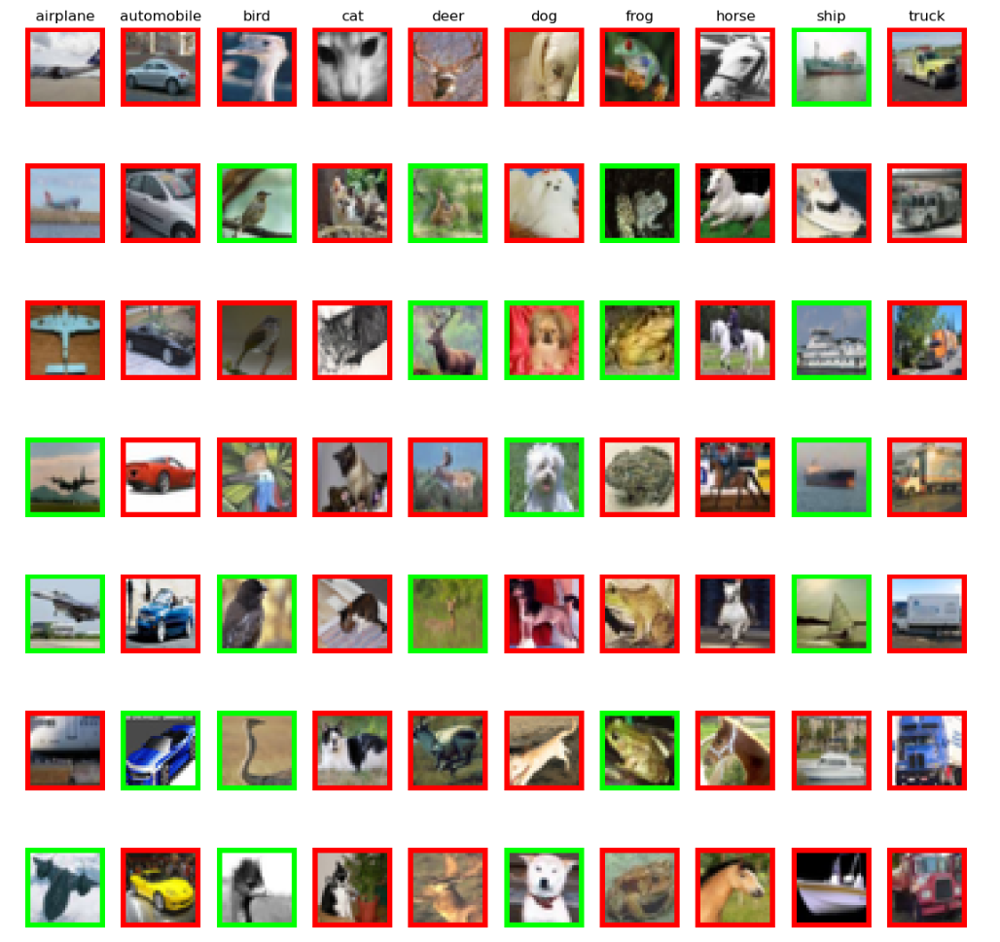
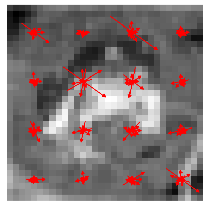
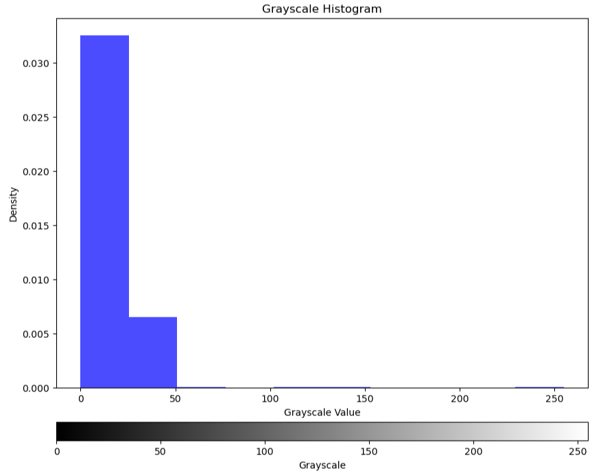

# cs231n_2017
日常挖坑，当作自己的学习笔记。之前一直都是自己零零散散地学习计算机视觉效果的东西，感觉会一点东西，但都很碎片话。感觉得下定决心，听点专业的系统课程，来完善下这方面的理解。关于斯坦福李飞飞cs231n计算机视觉课程的个人笔记以及作业库。

# 大量参考了其他前辈的作业，加上了很多自己的理解

你将看到以下内容

用红色表示错误分类，用绿色表示正确类的可视化效果

各种梯度相关的杂七杂八的概念的一些理解，以及方向梯度的可视化效果

对图片颜色的抽特征的理解，色调饱和度明度（HSV）特征来表示一张图片
